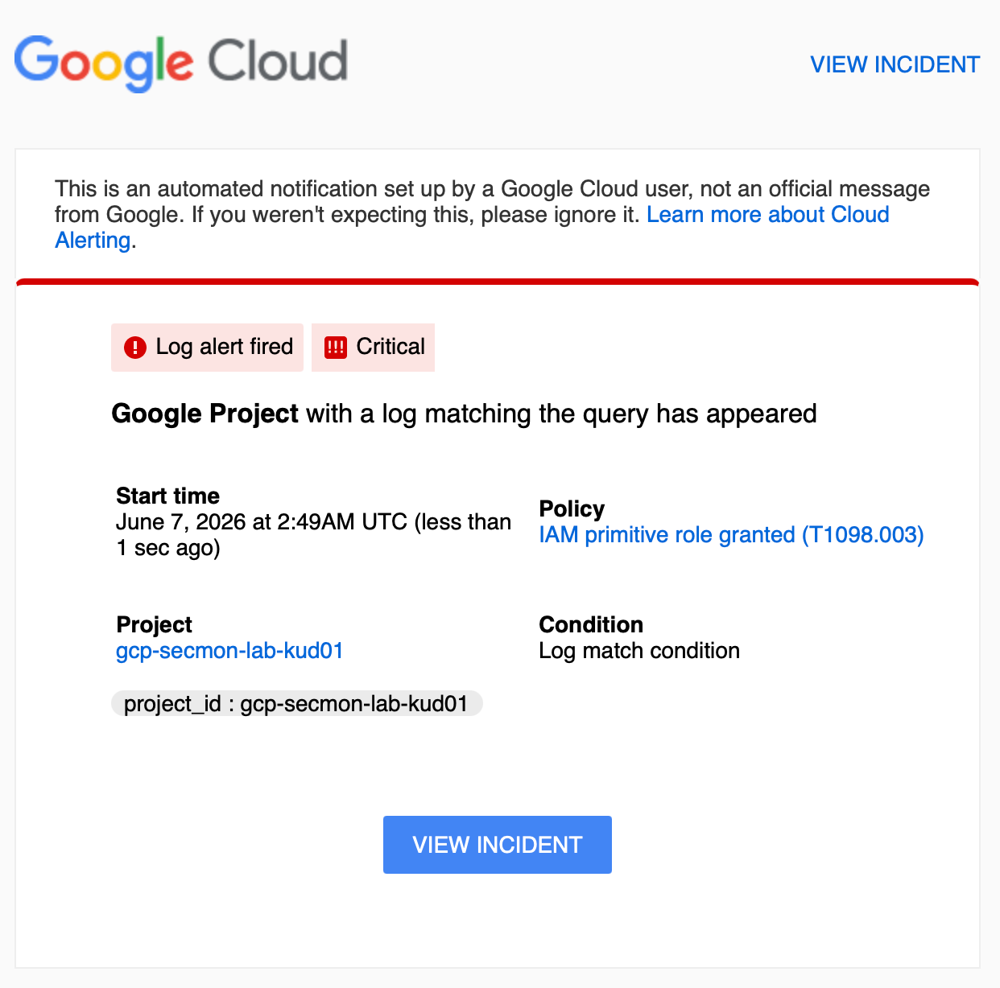
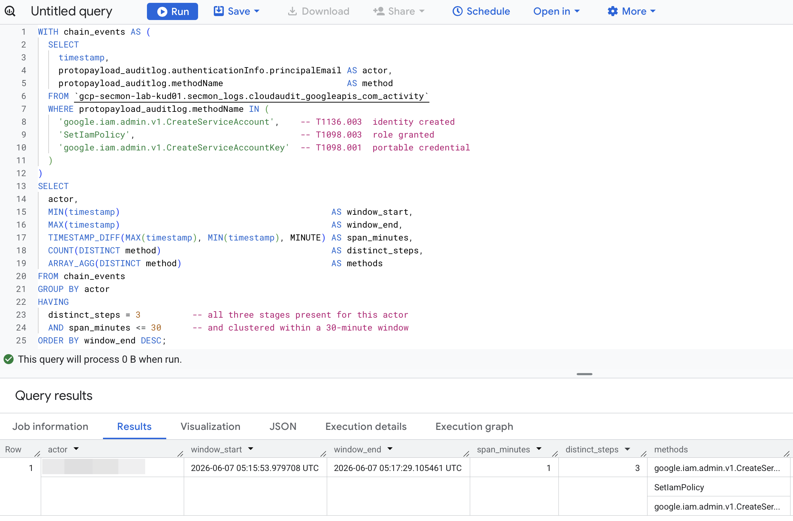

# GCP Security Monitoring Lab

> Cloud detection engineering on Google Cloud — the cloud-native mirror of an on-prem SIEM detection chain. Enable audit logging, write detection rules against the logs, then simulate the matching attacks to prove each rule fires.


## What this demonstrates

| Skill | Evidence |
|---|---|
| Cloud audit logging | Enable + query GCP Admin Activity logs ([`docs/`](docs/)) |
| Detection engineering | Cloud Logging filters mapped to MITRE ATT&CK ([`detections/`](detections/)) |
| Attack simulation | Scripts that trigger each detection to validate it ([`scripts/simulate/`](scripts/simulate/)) |
| Operational alerting | Log-based alert policy (as YAML) that fires + emails on a detection ([`alerting/`](alerting/), [`docs/04-alerting.md`](docs/04-alerting.md)) |
| SQL correlation | Multi-event persistence-chain detection in BigQuery SQL — catches a *sequence* no filter can ([`detections/bigquery-sql/`](detections/bigquery-sql/), [`docs/05-bigquery-sql.md`](docs/05-bigquery-sql.md)) |
| Cloud cost discipline | Free-tier-only design + budget alert + teardown ([`docs/00-prerequisites.md`](docs/00-prerequisites.md)) |
| Secure-by-default repo | Credential-guarding `.gitignore`, no secrets in history |

## Architecture

```
gcloud CLI ──> GCP Project ──> Cloud Audit Logs (Admin Activity, free)
                                        │
                                        ├──> Log Explorer filters  ── 6 detection rules ✅
                                        ├──> BigQuery sink          ── SQL correlation ✅
                                        └──> Cloud Monitoring       ── log-based alert ✅
                                        ▲
              scripts/simulate/*.sh ────┘  (generate the malicious events to validate detections)
```

## Detection coverage

| # | Detection | MITRE ATT&CK (Cloud) | Filter | Evidence |
|---|---|---|---|---|
| 1 | [IAM role granted (primitive roles)](detections/logging-filters/iam-role-granted.md) | T1098.003 | ✅ | ✅ [screenshot](screenshots/01-iam-role-granted.png) |
| 2 | [Service account key created](detections/logging-filters/sa-key-created.md) | T1098.001 | ✅ | ✅ [screenshot](screenshots/02-sa-key-created.png) |
| 3 | [Storage bucket made public](detections/logging-filters/public-bucket.md) | T1530 | ✅ | ✅ [screenshot](screenshots/03-public-bucket.png) |
| 4 | [Audit logging disabled](detections/logging-filters/audit-config-changed.md) | T1562.008 | ✅ | validated locally |
| 5 | [Firewall opened to internet](detections/logging-filters/firewall-open-ingress.md) | T1562.007 | ✅ | validated locally |
| 6 | [Service account created](detections/logging-filters/service-account-created.md) | T1136.003 | ✅ | validated locally |

All six detections query the always-on, free **Admin Activity** audit log. See [`detections/mitre-mapping.md`](detections/mitre-mapping.md) for the full ATT&CK coverage + the correlation chain.

## Evidence

Each detection was validated by simulating the matching attack and confirming it fires (see [`docs/03-run-and-capture.md`](docs/03-run-and-capture.md)).

**IAM role granted (T1098.003)** — `SetIamPolicy` adding `roles/editor`:


**Service account key created (T1098.001)** — `CreateServiceAccountKey`:


**Storage bucket made public (T1530)** — `storage.setIamPermissions`:


**Live alert (Cloud Monitoring)** — the IAM role-grant detection promoted to a log-based alert that fires **and emails** on match (see [`docs/04-alerting.md`](docs/04-alerting.md)):


**SQL correlation (T1136.003 → T1098.003 → T1098.001)** — a BigQuery query catches the *persistence chain*: one actor created a service account, granted a role, and minted a key within a 1-minute window (`distinct_steps: 3`). No single filter can produce this — see [`docs/05-bigquery-sql.md`](docs/05-bigquery-sql.md):


## Repository structure

See [`PLAN.md`](PLAN.md) for the full implementation plan, phases, and success criteria.

```
docs/         Numbered concepts + setup + walkthrough guides
detections/   6 Logging filters + BigQuery SQL (correlation) + MITRE mapping
alerting/     Log-based alert policy (Monitoring, as YAML)
scripts/      Attack-simulation + alert-setup + teardown
screenshots/  Detection + alert evidence
```

## Getting started

Follow the numbered guides in order:

1. [`docs/00-prerequisites.md`](docs/00-prerequisites.md) — install gcloud, create a project, set a budget alert.
2. [`docs/01-concepts.md`](docs/01-concepts.md) — **study first:** the ideas behind the lab (IAM, service accounts, audit logs, MITRE ATT&CK, detection engineering).
3. [`docs/02-enable-audit-logging.md`](docs/02-enable-audit-logging.md) — turn on the audit logs the detections query.
4. [`docs/03-run-and-capture.md`](docs/03-run-and-capture.md) — run the attack simulations and screenshot each detection firing.
5. [`docs/04-alerting.md`](docs/04-alerting.md) — turn a detection into a live alert that fires + emails on its own.
6. [`docs/05-bigquery-sql.md`](docs/05-bigquery-sql.md) — route logs to BigQuery and write a SQL **correlation** detection (the persistence chain).

Evidence lands in [`screenshots/`](screenshots/).

## License

[MIT](LICENSE)
