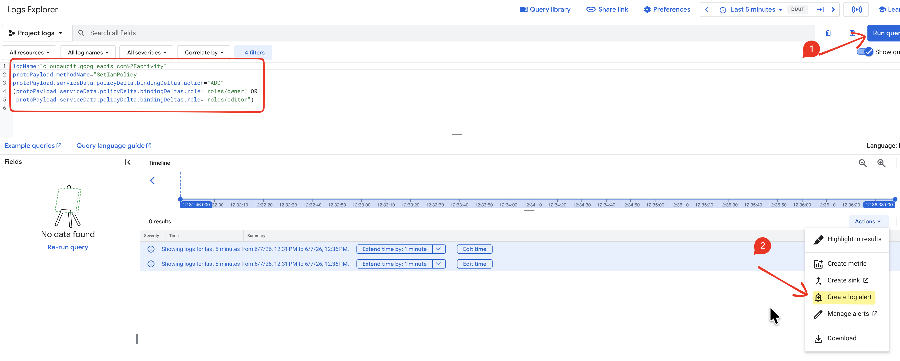
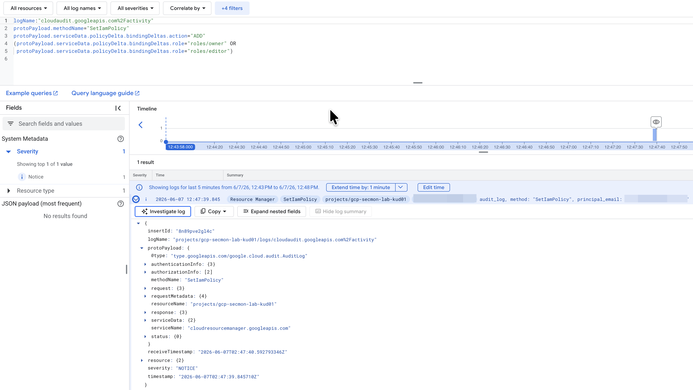

# 04 — Alerting (make a detection fire on its own)

So far your detections are queries you _run_. This doc turns one into a **live alert** — GCP watches the logs continuously and emails you the moment the detection matches. ~10 minutes.

> 📖 **Study:** a **log-based alert** is an alert policy whose condition is "a log entry matched this filter." It reuses the _exact same filter_ from your detection — no new logic, you're just making it continuous. This is the operational core of a SOC: detections must alert without a human running queries. ([concepts §6](01-concepts.md#6-detection-engineering--the-loop))

We alert on **IAM role granted (T1098.003)** — the highest-signal hero detection.

---

## Path A — Console (recommended, no setup)

1. Open Log Explorer: <https://console.cloud.google.com/logs/query?project=gcp-secmon-lab-kud01>
2. Paste the detection filter and **Run query**:

   ```
   logName:"cloudaudit.googleapis.com%2Factivity"
   protoPayload.methodName="SetIamPolicy"
   protoPayload.serviceData.policyDelta.bindingDeltas.action="ADD"
   (protoPayload.serviceData.policyDelta.bindingDeltas.role="roles/owner" OR
    protoPayload.serviceData.policyDelta.bindingDeltas.role="roles/editor")
   ```

3. Click **Actions → Create log alert** (top of the results).

   

4. Name it `IAM primitive role granted (T1098.003)`, set a notification frequency (e.g. 5 min).
5. Add a **notification channel** → Email → your address.
6. Save.

## Path B — Infrastructure-as-code (the committed artifact)

The same policy lives in [`alerting/iam-role-granted-alert.yaml`](../alerting/iam-role-granted-alert.yaml). Apply it via script (needs alpha/beta components once: `gcloud components install beta alpha`):

```bash
ALERT_EMAIL="you@example.com" ./scripts/setup/01-create-alert.sh
```

> Committing the policy as YAML is the portfolio win: your alerting is **versioned, reviewable code**, not a one-off click.

---

## Trigger it and capture the evidence

The test SA was removed at teardown, so recreate it, then run the attack:

```bash
./scripts/simulate/01-sim-sa-created.sh
./scripts/simulate/02-sim-iam-role-granted.sh
```

**You'll see** (a `[*] retrying…` line may appear — that's the propagation-retry fix doing its job):

```
❯ ./scripts/simulate/01-sim-sa-created.sh
[=] Service account secmon-test-sa already exists (ok)
❯ ./scripts/simulate/02-sim-iam-role-granted.sh
[+] Granted roles/editor to secmon-test-sa@gcp-secmon-lab-kud01.iam.gserviceaccount.com
```

Within ~1–2 minutes the policy fires: an **incident** opens in Monitoring → Alerting **and** an email lands in your inbox.

### Evidence

The alert email — proof it fired *and* notified:


The matched log entry that triggered it — what an analyst pivots on (`principalEmail` scrubbed):



Then tear down: `./scripts/teardown.sh` (and delete the alert policy + channel in the console if you're fully done).

---

## ✅ Done — checklist

- [x] Alert policy created
- [x] Attack re-run → alert fired + email received
- [x] Evidence captured (`screenshots/04-alert-fired.png`, `04-alert-matched-log.png`)

This is the difference between a detection *rule* and a detection *that protects you*. With this, the GCP lab covers the full loop: **log → detect → simulate → alert.**
